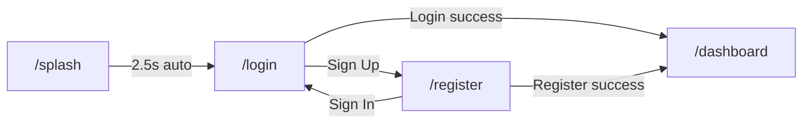

# 📦 Phase 2 — Code Diff Report: Authentication Screens

> **Status:** ✅ Hoàn thành  
> **Build:** ✅ `√ Built build\windows\x64\runner\Debug\summarize_ai_app.exe`

---

## Cấu trúc thư mục Phase 2

```
features/auth/
├── data/
│   └── models/
│       └── user_model.dart              ← NEW: User data model
├── providers/
│   └── auth_provider.dart               ← NEW: Riverpod StateNotifier
└── presentation/
    ├── screens/
    │   ├── splash_screen.dart           ← NEW: Animated splash
    │   ├── login_screen.dart            ← NEW: Glassmorphism login
    │   └── register_screen.dart         ← NEW: Glassmorphism register
    └── widgets/
        └── auth_gradient_background.dart ← NEW: Shared background

core/routes/
└── app_router.dart                      ← UPDATED: Real screens + transitions
```

**Files mới: 6** | **Files cập nhật: 1** | **Files xoá: 1** (`.gitkeep.dart`)

---

## 1. Data Layer — `user_model.dart`

Immutable data class với `copyWith`:

```dart
class UserModel {
  final String id;
  final String name;
  final String email;
  final String? avatarUrl;
}
```

[View full file → user_model.dart](file:///e:/HUS/subject/Code/Data%20Mining/Project/code/App/ai_summarize_app_project/summarize_ai_app/lib/features/auth/data/models/user_model.dart)

---

## 2. State Management — `auth_provider.dart`

### AuthState

| Property | Type | Mô tả |
|----------|------|--------|
| `status` | `AuthStatus` | `idle` / `loading` / `authenticated` / `unauthenticated` / `error` |
| `user` | `UserModel?` | User data khi authenticated |
| `errorMessage` | `String?` | Error message nếu có |

### AuthNotifier methods

| Method | Returns | Mô tả |
|--------|---------|--------|
| `login(email, password)` | `Future<bool>` | Mock login, delay ~2s, luôn thành công |
| `register(name, email, password)` | `Future<bool>` | Mock register, delay ~2s |
| `logout()` | `Future<void>` | Clear user state |
| `clearError()` | `void` | Reset error message |

```dart
final authProvider = StateNotifierProvider<AuthNotifier, AuthState>((ref) {
  return AuthNotifier(MockAuthService());
});
```

[View full file → auth_provider.dart](file:///e:/HUS/subject/Code/Data%20Mining/Project/code/App/ai_summarize_app_project/summarize_ai_app/lib/features/auth/providers/auth_provider.dart)

---

## 3. Splash Screen

### Thiết kế
- **Background:** Dark gradient (`#0A1A0F` → `#0A0A0A` → `#0D1117`)
- **Logo:** Green gradient rounded square + `Icons.auto_awesome`
- **Glow:** Radial green glow phía sau logo, pulsing scale animation
- **Text:** "AI PDF" (white, bold) + "Summarizer" (neon green)
- **Loading:** CircularProgressIndicator xanh

### Animations (staggered)
1. `0ms` — Logo scale elasticOut + fadeIn
2. `300ms` — "AI PDF" text slideUp + fadeIn
3. `500ms` — "Summarizer" text slideUp + fadeIn
4. `800ms` — "Powered by AI" tagline fadeIn
5. `1000ms` — Loading indicator fadeIn
6. `2500ms` — Auto-navigate → `/login`

[View full file → splash_screen.dart](file:///e:/HUS/subject/Code/Data%20Mining/Project/code/App/ai_summarize_app_project/summarize_ai_app/lib/features/auth/presentation/screens/splash_screen.dart)

---

## 4. Login Screen

### Thiết kế
- **Background:** `AuthGradientBackground` (dark + green radial glows)
- **Card:** `GlassCard` (backdrop blur + semi-transparent border)
- **Responsive:** `maxWidth: 440px` (desktop) / full width (mobile)
- **Entry animation:** fadeIn + slideY(0.05 → 0)

### Form Elements

| Element | Chi tiết |
|---------|---------|
| Logo | Green gradient square, `Icons.auto_awesome` |
| Heading | "Welcome Back" + subtitle |
| Email field | `AppTextField` + mail icon + validation |
| Password field | Toggle visibility + min 6 chars validation |
| Remember me | Checkbox + label |
| Forgot password | TextButton (green) |
| Login button | `AppButton` gradient + loading spinner |
| Divider | "OR" with lines |
| Google login | `AppButton` outlined |
| Register link | "Don't have an account? Sign Up" |

### Validation
- Email: required + must contain `@`
- Password: required + min 6 characters
- Error message displayed in red container with icon

### Navigation
- Login success → `context.go('/dashboard')`
- Sign Up link → `context.go('/register')`

[View full file → login_screen.dart](file:///e:/HUS/subject/Code/Data%20Mining/Project/code/App/ai_summarize_app_project/summarize_ai_app/lib/features/auth/presentation/screens/login_screen.dart)

---

## 5. Register Screen

### Thiết kế
Tương tự Login screen nhưng với:
- Logo icon: `Icons.person_add_outlined`
- Heading: "Create Account"
- 4 fields: Name, Email, Password, Confirm Password

### Validation bổ sung
- Confirm Password: must match Password field
- Cross-field validation: `value != _passwordController.text`

### Navigation
- Register success → `context.go('/dashboard')`
- Sign In link → `context.go('/login')`

[View full file → register_screen.dart](file:///e:/HUS/subject/Code/Data%20Mining/Project/code/App/ai_summarize_app_project/summarize_ai_app/lib/features/auth/presentation/screens/register_screen.dart)

---

## 6. Auth Gradient Background (shared widget)

Dark gradient background với 3 radial green glows:
- **Top-right:** `primary` green, r=350px
- **Bottom-left:** `neonGreen`, r=300px
- **Center:** subtle `primary`, r=300px

[View full file → auth_gradient_background.dart](file:///e:/HUS/subject/Code/Data%20Mining/Project/code/App/ai_summarize_app_project/summarize_ai_app/lib/features/auth/presentation/widgets/auth_gradient_background.dart)

---

## 7. Router Update — `app_router.dart`

```diff:app_router.dart
===
import 'package:flutter/material.dart';
import 'package:go_router/go_router.dart';
import '../../features/auth/presentation/screens/splash_screen.dart';
import '../../features/auth/presentation/screens/login_screen.dart';
import '../../features/auth/presentation/screens/register_screen.dart';

/// Application router configuration using GoRouter.
/// Auth screens are fully implemented; dashboard screens use placeholders.
class AppRouter {
  AppRouter._();

  static final GlobalKey<NavigatorState> _rootNavigatorKey =
      GlobalKey<NavigatorState>(debugLabel: 'root');
  static final GlobalKey<NavigatorState> _shellNavigatorKey =
      GlobalKey<NavigatorState>(debugLabel: 'shell');

  static final GoRouter router = GoRouter(
    navigatorKey: _rootNavigatorKey,
    initialLocation: '/splash',
    debugLogDiagnostics: true,
    routes: [
      // ── Auth Routes (with transitions) ─────────────────────────
      GoRoute(
        path: '/splash',
        name: 'splash',
        pageBuilder: (context, state) => CustomTransitionPage(
          key: state.pageKey,
          child: const SplashScreen(),
          transitionsBuilder: (context, animation, secondaryAnimation, child) {
            return FadeTransition(opacity: animation, child: child);
          },
          transitionDuration: const Duration(milliseconds: 400),
        ),
      ),
      GoRoute(
        path: '/login',
        name: 'login',
        pageBuilder: (context, state) => CustomTransitionPage(
          key: state.pageKey,
          child: const LoginScreen(),
          transitionsBuilder: (context, animation, secondaryAnimation, child) {
            return FadeTransition(
              opacity: CurvedAnimation(
                parent: animation,
                curve: Curves.easeInOut,
              ),
              child: child,
            );
          },
          transitionDuration: const Duration(milliseconds: 500),
        ),
      ),
      GoRoute(
        path: '/register',
        name: 'register',
        pageBuilder: (context, state) => CustomTransitionPage(
          key: state.pageKey,
          child: const RegisterScreen(),
          transitionsBuilder: (context, animation, secondaryAnimation, child) {
            // Slide up + fade for register
            final offsetAnimation = Tween<Offset>(
              begin: const Offset(0.0, 0.05),
              end: Offset.zero,
            ).animate(CurvedAnimation(
              parent: animation,
              curve: Curves.easeOutCubic,
            ));
            return FadeTransition(
              opacity: animation,
              child: SlideTransition(
                position: offsetAnimation,
                child: child,
              ),
            );
          },
          transitionDuration: const Duration(milliseconds: 400),
        ),
      ),

      // ── Dashboard Shell Route ──────────────────────────────────
      ShellRoute(
        navigatorKey: _shellNavigatorKey,
        builder: (context, state, child) {
          // Dashboard shell layout will wrap the child with sidebar + chat panel
          return _PlaceholderShell(child: child);
        },
        routes: [
          GoRoute(
            path: '/dashboard',
            name: 'dashboard',
            pageBuilder: (context, state) => CustomTransitionPage(
              key: state.pageKey,
              child: const _PlaceholderScreen(title: 'Dashboard Home'),
              transitionsBuilder:
                  (context, animation, secondaryAnimation, child) {
                return FadeTransition(opacity: animation, child: child);
              },
            ),
            routes: [
              GoRoute(
                path: 'summary',
                name: 'summary',
                pageBuilder: (context, state) => CustomTransitionPage(
                  key: state.pageKey,
                  child: const _PlaceholderScreen(title: 'PDF Summary'),
                  transitionsBuilder:
                      (context, animation, secondaryAnimation, child) {
                    return FadeTransition(opacity: animation, child: child);
                  },
                ),
              ),
              GoRoute(
                path: 'chat',
                name: 'chat',
                pageBuilder: (context, state) => CustomTransitionPage(
                  key: state.pageKey,
                  child: const _PlaceholderScreen(title: 'AI Chat'),
                  transitionsBuilder:
                      (context, animation, secondaryAnimation, child) {
                    return FadeTransition(opacity: animation, child: child);
                  },
                ),
              ),
              GoRoute(
                path: 'history',
                name: 'history',
                pageBuilder: (context, state) => CustomTransitionPage(
                  key: state.pageKey,
                  child: const _PlaceholderScreen(title: 'History'),
                  transitionsBuilder:
                      (context, animation, secondaryAnimation, child) {
                    return FadeTransition(opacity: animation, child: child);
                  },
                ),
              ),
              GoRoute(
                path: 'analytics',
                name: 'analytics',
                pageBuilder: (context, state) => CustomTransitionPage(
                  key: state.pageKey,
                  child: const _PlaceholderScreen(title: 'Analytics'),
                  transitionsBuilder:
                      (context, animation, secondaryAnimation, child) {
                    return FadeTransition(opacity: animation, child: child);
                  },
                ),
              ),
              GoRoute(
                path: 'profile',
                name: 'profile',
                pageBuilder: (context, state) => CustomTransitionPage(
                  key: state.pageKey,
                  child: const _PlaceholderScreen(title: 'Profile'),
                  transitionsBuilder:
                      (context, animation, secondaryAnimation, child) {
                    return FadeTransition(opacity: animation, child: child);
                  },
                ),
              ),
            ],
          ),
        ],
      ),
    ],
  );
}

/// Temporary placeholder screen for dashboard routes (Phase 3+).
class _PlaceholderScreen extends StatelessWidget {
  const _PlaceholderScreen({required this.title});

  final String title;

  @override
  Widget build(BuildContext context) {
    return Scaffold(
      body: Center(
        child: Column(
          mainAxisAlignment: MainAxisAlignment.center,
          children: [
            Icon(
              Icons.construction_rounded,
              size: 64,
              color:
                  Theme.of(context).colorScheme.primary.withValues(alpha: 0.5),
            ),
            const SizedBox(height: 16),
            Text(
              title,
              style: Theme.of(context).textTheme.headlineMedium,
            ),
            const SizedBox(height: 8),
            Text(
              'Coming in next phase...',
              style: Theme.of(context).textTheme.bodyMedium?.copyWith(
                    color: Theme.of(context)
                        .colorScheme
                        .onSurface
                        .withValues(alpha: 0.5),
                  ),
            ),
          ],
        ),
      ),
    );
  }
}

/// Temporary placeholder shell for the dashboard layout.
class _PlaceholderShell extends StatelessWidget {
  const _PlaceholderShell({required this.child});

  final Widget child;

  @override
  Widget build(BuildContext context) {
    return child;
  }
}

```

### Page Transitions

| Route | Animation | Duration |
|-------|-----------|----------|
| `/splash` | Fade | 400ms |
| `/login` | Fade (easeInOut) | 500ms |
| `/register` | SlideUp + Fade (easeOutCubic) | 400ms |
| Dashboard routes | Fade | 300ms (default) |

---

## Screen Flow



---

## ✅ Phase 2 Checklist

| Item | Status |
|------|--------|
| `UserModel` data class | ✅ |
| `AuthProvider` (Riverpod StateNotifier) | ✅ |
| `MockAuthService` integration | ✅ |
| Splash Screen + animations | ✅ |
| Login Screen + glassmorphism + responsive | ✅ |
| Register Screen + cross-field validation | ✅ |
| Auth gradient background widget | ✅ |
| GoRouter transitions (fade/slide) | ✅ |
| Form validation (email, password, confirm) | ✅ |
| Error display UI | ✅ |
| Loading state UI (spinner button) | ✅ |
| Windows debug build | ✅ |

---

> [!TIP]
> **Sẵn sàng cho Phase 3:** Auth flow hoàn chỉnh. Phase 3 sẽ xây dựng Dashboard shell layout 3 cột (Sidebar | Content | AI Chat), responsive navigation, và mobile drawer/bottom nav.
