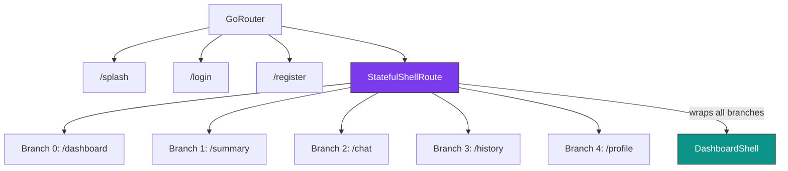

# 📦 Phase 3 — Code Diff Report: Dashboard Layout & Sidebar

> **Status:** ✅ Hoàn thành  
> **Build:** ✅ `√ Built summarize_ai_app.exe` (10.9s)

---

## Cấu trúc thư mục Phase 3

```
features/dashboard/
├── data/
│   └── navigation_items.dart              ← NEW: Shared nav data
└── presentation/
    ├── screens/
    │   ├── dashboard_shell.dart           ← NEW: Responsive layout shell
    │   └── placeholder_content_screen.dart ← NEW: Generic tab placeholder
    └── widgets/
        ├── sidebar.dart                   ← NEW: Desktop/tablet sidebar
        ├── mobile_bottom_nav.dart         ← NEW: Mobile bottom nav
        ├── mobile_drawer.dart             ← NEW: Mobile drawer
        └── ai_chat_panel_placeholder.dart ← NEW: Right chat panel

core/routes/
└── app_router.dart                        ← REWRITTEN: StatefulShellRoute
```

**Files mới: 7** | **Files cập nhật: 1** | **Files xoá: 1** (`.gitkeep.dart`)

---

## 1. Responsive Layout — `dashboard_shell.dart`

### Desktop (≥1200px)
```
┌──────────┬─────────────────────┬──────────┐
│ Sidebar  │   Main Content      │ AI Chat  │
│ (260px)  │   (Expanded)        │ (360px)  │
│          │                     │          │
└──────────┴─────────────────────┴──────────┘
```

### Tablet (600–1200px)
```
┌────┬────────────────────────────────────┐
│ 🔧 │       Main Content                 │
│icon│       (Expanded)                    │
│only│                                     │
└────┴────────────────────────────────────┘
```

### Mobile (<600px)
```
┌─ AppBar ─── [☰] AI Chat ──────────────┐
│                                         │
│         Main Content                    │
│                                         │
├─ Bottom Nav ────────────────────────────┤
│  📊    📄    💬    📚    👤            │
└─────────────────────────────────────────┘
+ Drawer (opens from ☰)
```

[View file → dashboard_shell.dart](file:///e:/HUS/subject/Code/Data%20Mining/Project/code/App/ai_summarize_app_project/summarize_ai_app/lib/features/dashboard/presentation/screens/dashboard_shell.dart)

---

## 2. Sidebar — `sidebar.dart`

### Expanded mode (Desktop)
| Section | Chi tiết |
|---------|---------|
| Logo | Green gradient icon + "AI PDF Summarizer" text |
| New Summary | `AppButton` gradient green, full width |
| Menu label | "MENU" section header |
| Nav items | 5 items with icon + label, active green bg + border |
| User profile | Avatar circle + name + email |
| Logout | Icon + "Logout" with red hover |

### Collapsed mode (Tablet)
- Width: 72px (animated from 260px)
- All items show icon only with `Tooltip`
- Logo shows icon only

### Hover effects
- Nav items: `hoverColor: glassOverlay`
- Logout: `hoverColor: error.withAlpha(0.1)`
- Active item: green tinted background + border

[View file → sidebar.dart](file:///e:/HUS/subject/Code/Data%20Mining/Project/code/App/ai_summarize_app_project/summarize_ai_app/lib/features/dashboard/presentation/widgets/sidebar.dart)

---

## 3. Mobile Components

### `mobile_bottom_nav.dart`
- 5 tabs matching sidebar items
- Active: green icon + label, inactive: muted
- Fixed height 60px with SafeArea

### `mobile_drawer.dart`
- Full sidebar content in Drawer format
- Logo + New Summary button + nav items + user profile
- Auto-closes drawer on navigation (`Navigator.pop`)

---

## 4. Router — `app_router.dart` (Rewritten)

### Cấu trúc mới: `StatefulShellRoute.indexedStack`



### Key changes
- Switched from nested `ShellRoute` to `StatefulShellRoute.indexedStack`
- Each tab is a separate **branch** with own `NavigatorKey`
- Tab state is **preserved** when switching (IndexedStack)
- Dashboard content uses `NoTransitionPage` (instant switch)

```diff:app_router.dart
===
import 'package:flutter/material.dart';
import 'package:go_router/go_router.dart';
import '../../features/auth/presentation/screens/splash_screen.dart';
import '../../features/auth/presentation/screens/login_screen.dart';
import '../../features/auth/presentation/screens/register_screen.dart';
import '../../features/dashboard/presentation/screens/dashboard_shell.dart';
import '../../features/dashboard/presentation/screens/placeholder_content_screen.dart';

/// Application router using GoRouter with StatefulShellRoute for dashboard.
class AppRouter {
  AppRouter._();

  static final GlobalKey<NavigatorState> _rootNavigatorKey =
      GlobalKey<NavigatorState>(debugLabel: 'root');

  // Branch navigator keys
  static final _dashboardNavKey =
      GlobalKey<NavigatorState>(debugLabel: 'dashboardNav');
  static final _summaryNavKey =
      GlobalKey<NavigatorState>(debugLabel: 'summaryNav');
  static final _chatNavKey =
      GlobalKey<NavigatorState>(debugLabel: 'chatNav');
  static final _historyNavKey =
      GlobalKey<NavigatorState>(debugLabel: 'historyNav');
  static final _profileNavKey =
      GlobalKey<NavigatorState>(debugLabel: 'profileNav');

  static final GoRouter router = GoRouter(
    navigatorKey: _rootNavigatorKey,
    initialLocation: '/splash',
    debugLogDiagnostics: true,
    routes: [
      // ── Auth Routes ────────────────────────────────────────────
      GoRoute(
        path: '/splash',
        name: 'splash',
        pageBuilder: (context, state) => CustomTransitionPage(
          key: state.pageKey,
          child: const SplashScreen(),
          transitionsBuilder: (_, animation, __, child) =>
              FadeTransition(opacity: animation, child: child),
          transitionDuration: const Duration(milliseconds: 400),
        ),
      ),
      GoRoute(
        path: '/login',
        name: 'login',
        pageBuilder: (context, state) => CustomTransitionPage(
          key: state.pageKey,
          child: const LoginScreen(),
          transitionsBuilder: (_, animation, __, child) => FadeTransition(
            opacity: CurvedAnimation(
                parent: animation, curve: Curves.easeInOut),
            child: child,
          ),
          transitionDuration: const Duration(milliseconds: 500),
        ),
      ),
      GoRoute(
        path: '/register',
        name: 'register',
        pageBuilder: (context, state) => CustomTransitionPage(
          key: state.pageKey,
          child: const RegisterScreen(),
          transitionsBuilder: (_, animation, __, child) {
            final offset = Tween<Offset>(
              begin: const Offset(0.0, 0.05),
              end: Offset.zero,
            ).animate(CurvedAnimation(
                parent: animation, curve: Curves.easeOutCubic));
            return FadeTransition(
              opacity: animation,
              child: SlideTransition(position: offset, child: child),
            );
          },
          transitionDuration: const Duration(milliseconds: 400),
        ),
      ),

      // ── Dashboard (StatefulShellRoute) ─────────────────────────
      StatefulShellRoute.indexedStack(
        builder: (context, state, navigationShell) {
          return DashboardShell(navigationShell: navigationShell);
        },
        branches: [
          // Branch 0: Dashboard Home
          StatefulShellBranch(
            navigatorKey: _dashboardNavKey,
            routes: [
              GoRoute(
                path: '/dashboard',
                name: 'dashboard',
                pageBuilder: (context, state) => const NoTransitionPage(
                  child: PlaceholderContentScreen(
                    title: 'Dashboard',
                    icon: Icons.grid_view_rounded,
                    subtitle: 'Welcome to AI PDF Summarizer.\nYour analytics and overview will appear here.',
                  ),
                ),
              ),
            ],
          ),

          // Branch 1: PDF Summary
          StatefulShellBranch(
            navigatorKey: _summaryNavKey,
            routes: [
              GoRoute(
                path: '/summary',
                name: 'summary',
                pageBuilder: (context, state) => const NoTransitionPage(
                  child: PlaceholderContentScreen(
                    title: 'PDF Summary',
                    icon: Icons.description_rounded,
                    subtitle: 'Upload a PDF document to generate\nan AI-powered summary.',
                  ),
                ),
              ),
            ],
          ),

          // Branch 2: AI Chat
          StatefulShellBranch(
            navigatorKey: _chatNavKey,
            routes: [
              GoRoute(
                path: '/chat',
                name: 'chat',
                pageBuilder: (context, state) => const NoTransitionPage(
                  child: PlaceholderContentScreen(
                    title: 'AI Chat',
                    icon: Icons.chat_bubble_rounded,
                    subtitle: 'Start a conversation with AI\nabout your documents.',
                  ),
                ),
              ),
            ],
          ),

          // Branch 3: History
          StatefulShellBranch(
            navigatorKey: _historyNavKey,
            routes: [
              GoRoute(
                path: '/history',
                name: 'history',
                pageBuilder: (context, state) => const NoTransitionPage(
                  child: PlaceholderContentScreen(
                    title: 'History',
                    icon: Icons.history_rounded,
                    subtitle: 'Your recent uploads, summaries,\nand chat sessions.',
                  ),
                ),
              ),
            ],
          ),

          // Branch 4: Profile
          StatefulShellBranch(
            navigatorKey: _profileNavKey,
            routes: [
              GoRoute(
                path: '/profile',
                name: 'profile',
                pageBuilder: (context, state) => const NoTransitionPage(
                  child: PlaceholderContentScreen(
                    title: 'Profile',
                    icon: Icons.person_rounded,
                    subtitle: 'Manage your account settings\nand preferences.',
                  ),
                ),
              ),
            ],
          ),
        ],
      ),
    ],
  );
}

```

---

## 5. Supporting Files

### `navigation_items.dart`
Shared `NavItemData` class and `mainNavItems` list (5 items) used by sidebar, drawer, and bottom nav.

### `placeholder_content_screen.dart`
Generic placeholder with animated icon + title + subtitle for each tab.

### `ai_chat_panel_placeholder.dart`
Right-side panel (360px) with header, welcome message, and disabled input bar.

---

## ✅ Phase 3 Checklist

| Item | Status |
|------|--------|
| `StatefulShellRoute` với 5 branches | ✅ |
| `DashboardShell` responsive layout | ✅ |
| Desktop 3-column layout | ✅ |
| Tablet collapsed sidebar (icon-only) | ✅ |
| Mobile drawer + bottom nav | ✅ |
| Sidebar: logo, nav items, user profile, logout | ✅ |
| Sidebar: hover effects + active state | ✅ |
| Sidebar: animated collapse | ✅ |
| "+ New Summary" gradient button | ✅ |
| AI Chat panel placeholder (desktop) | ✅ |
| Placeholder screens cho 5 tabs | ✅ |
| Auth → Dashboard navigation flow | ✅ |
| Windows debug build | ✅ |

---

> [!TIP]
> **Sẵn sàng cho Phase 4:** Layout hoàn chỉnh và responsive. Phase 4 sẽ thay thế các placeholder bằng real screens: PDF Upload/Summary và AI Chat.
