# 📦 Phase 4 — Code Diff (Part 1): PDF Summary Feature

> **Status:** ✅ Build thành công  
> **Build:** `√ Built summarize_ai_app.exe` (10.6s)

---

## Cấu trúc thư mục mới

```
features/
├── pdf_summary/
│   ├── data/models/
│   │   └── summary_state.dart          ← NEW: State model + enum
│   ├── providers/
│   │   └── summary_provider.dart       ← NEW: Riverpod StateNotifier
│   └── presentation/
│       ├── screens/
│       │   └── pdf_summary_screen.dart ← NEW: Main screen
│       └── widgets/
│           ├── upload_drop_zone.dart    ← NEW: Drag & drop area
│           ├── file_preview_card.dart   ← NEW: File info + progress
│           └── summary_result_view.dart ← NEW: Markdown result + actions
└── ai_chat/ (xem Part 2)
```

---

## 1. State Machine — `SummaryState`

```mermaid
stateDiagram-v2
    [*] --> idle
    idle --> selected : selectFile()
    selected --> uploading : startSummarization()
    selected --> idle : clearFile()
    uploading --> processing : upload complete
    processing --> completed : AI done
    processing --> error : exception
    completed --> idle : clearFile()
    error --> idle : clearFile()
    
    style idle fill:#1a1a2e
    style selected fill:#1e3a5f
    style uploading fill:#2d4a22
    style processing fill:#4a3a00
    style completed fill:#004d40
    style error fill:#5a1a1a
```



| Status | UI Hiển thị |
|--------|-------------|
| `idle` | Upload Drop Zone (dashed border, hover effect) |
| `selected` | File Preview Card + "Generate Summary" button |
| `uploading` | Progress bar animation (0→100% over ~2s) |
| `processing` | Shimmer skeleton loading |
| `completed` | Rendered Markdown + Copy/New buttons |
| `error` | Error card with retry button |

[View → summary_state.dart](file:///e:/HUS/subject/Code/Data%20Mining/Project/code/App/ai_summarize_app_project/summarize_ai_app/lib/features/pdf_summary/data/models/summary_state.dart)

---

## 2. Provider — `SummaryNotifier`

### Pipeline flow:
1. `selectFile()` → stores filename + size
2. `startSummarization()` →
   - Simulates **upload** with `Timer.periodic` (80ms × 25 ticks = ~2s)
   - Calls `MockSummaryService.uploadPdf()`
   - Calls `MockSummaryService.summarize()` (~3s delay)
   - Sets `completed` with markdown result

[View → summary_provider.dart](file:///e:/HUS/subject/Code/Data%20Mining/Project/code/App/ai_summarize_app_project/summarize_ai_app/lib/features/pdf_summary/providers/summary_provider.dart)

---

## 3. Upload Drop Zone Widget

| Feature | Chi tiết |
|---------|---------|
| Hover effect | Background tint + border color changes to green |
| Icon | Cloud upload, animates color on hover |
| Layout | Icon → "Drop your PDF here" → "or click to browse" → "PDF files up to 50MB" badge |
| Animation | `fadeIn` + `slideY` entrance |

[View → upload_drop_zone.dart](file:///e:/HUS/subject/Code/Data%20Mining/Project/code/App/ai_summarize_app_project/summarize_ai_app/lib/features/pdf_summary/presentation/widgets/upload_drop_zone.dart)

---

## 4. File Preview Card Widget

```
┌─────────────────────────────────────┐
│ 📕  document.pdf              ✕     │
│     245.3 KB                        │
│ ████████░░░░░░░░░░░░  42%           │  ← uploading
│ ════════════════════  AI analyzing  │  ← processing
└─────────────────────────────────────┘
```

[View → file_preview_card.dart](file:///e:/HUS/subject/Code/Data%20Mining/Project/code/App/ai_summarize_app_project/summarize_ai_app/lib/features/pdf_summary/presentation/widgets/file_preview_card.dart)

---

## 5. Summary Result View

| Feature | Chi tiết |
|---------|---------|
| Markdown rendering | `flutter_markdown` với styled `MarkdownStyleSheet` (headings, code, blockquotes, tables) |
| Action chips | Copy (clipboard), New Summary |
| Header | Green checkmark + "Summary Generated" |
| Code style | Fira Code monospace, green text |
| Blockquote | Left green border accent |

[View → summary_result_view.dart](file:///e:/HUS/subject/Code/Data%20Mining/Project/code/App/ai_summarize_app_project/summarize_ai_app/lib/features/pdf_summary/presentation/widgets/summary_result_view.dart)

---

## 6. Main Screen — `PdfSummaryScreen`

Orchestrates all widgets based on `SummaryStatus`:
- Uses `file_picker` for PDF file selection
- Shimmer loading skeleton during processing
- SnackBar feedback on copy
- Max content width: 720px, centered

[View → pdf_summary_screen.dart](file:///e:/HUS/subject/Code/Data%20Mining/Project/code/App/ai_summarize_app_project/summarize_ai_app/lib/features/pdf_summary/presentation/screens/pdf_summary_screen.dart)
