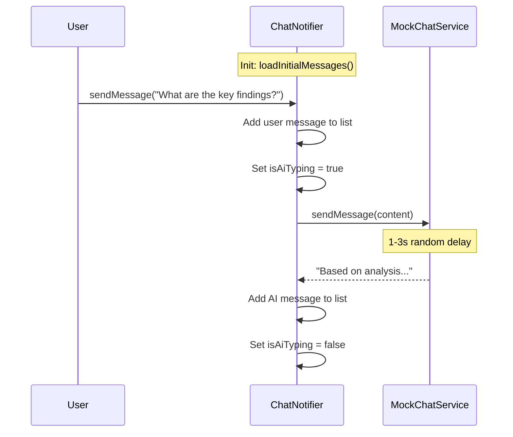

# 📦 Phase 4 — Code Diff (Part 2): AI Chat Feature

> **Status:** ✅ Build thành công  
> **Build:** `√ Built summarize_ai_app.exe` (10.6s)

---

## Cấu trúc thư mục mới

```
features/ai_chat/
├── data/models/
│   └── chat_message.dart              ← NEW: ChatMessage + ChatState
├── providers/
│   └── chat_provider.dart             ← NEW: ChatNotifier
└── presentation/
    ├── screens/
    │   └── ai_chat_screen.dart        ← NEW: Main chat screen
    └── widgets/
        ├── chat_bubble.dart           ← NEW: User/AI message bubbles
        ├── typing_indicator.dart      ← NEW: 3-dot animation
        └── chat_input_bar.dart        ← NEW: Input with keyboard handling

core/routes/
└── app_router.dart                    ← UPDATED: Real screens in branches 1 & 2
```

**Files mới: 6** | **Files cập nhật: 1** (router)

---

## 1. Chat State Model

```dart
class ChatMessage {
  final String id;
  final String content;
  final bool isUser;
  final DateTime timestamp;
}

class ChatState {
  final List<ChatMessage> messages;
  final bool isAiTyping;       // Controls typing indicator
  final String? errorMessage;
}
```

[View → chat_message.dart](file:///e:/HUS/subject/Code/Data%20Mining/Project/code/App/ai_summarize_app_project/summarize_ai_app/lib/features/ai_chat/data/models/chat_message.dart)

---

## 2. Chat Provider — `ChatNotifier`

### Flow:


[View → chat_provider.dart](file:///e:/HUS/subject/Code/Data%20Mining/Project/code/App/ai_summarize_app_project/summarize_ai_app/lib/features/ai_chat/providers/chat_provider.dart)

---

## 3. Chat Bubble Widget

### User message (right, green):
```
                   ┌────────────────────┐ ┌──┐
                   │ What are the key   │ │👤│
                   │ findings?          │ └──┘
                   └────────────────────┘
```

### AI message (left, dark + markdown):
```
┌──┐ ┌──────────────────────────────┐
│✨│ │ Based on the analysis:        │
└──┘ │ - **Point 1**: Revenue...     │
     │ - **Point 2**: Growth...      │
     └──────────────────────────────┘
```

| Feature | Chi tiết |
|---------|---------|
| User bubble | Green background, dark text, rounded corners (sharp bottom-right) |
| AI bubble | Dark background, markdown rendered, sharp bottom-left |
| Avatars | 32px rounded squares, person/sparkle icons |
| Animation | `fadeIn` + `slideX` (left for AI, right for user) |
| Markdown | Full `MarkdownBody` with styled headings, code, blockquotes |

[View → chat_bubble.dart](file:///e:/HUS/subject/Code/Data%20Mining/Project/code/App/ai_summarize_app_project/summarize_ai_app/lib/features/ai_chat/presentation/widgets/chat_bubble.dart)

---

## 4. Typing Indicator — 3 Bouncing Dots

```
┌──┐ ┌──────────┐
│✨│ │  ● ● ●   │  ← bouncing up/down, staggered
└──┘ └──────────┘
```

- 3 `AnimationController`s with 600ms duration
- Staggered start (0ms, 180ms, 360ms)
- `Tween<double>(0, -8)` for vertical bounce
- Auto `repeat(reverse: true)`

[View → typing_indicator.dart](file:///e:/HUS/subject/Code/Data%20Mining/Project/code/App/ai_summarize_app_project/summarize_ai_app/lib/features/ai_chat/presentation/widgets/typing_indicator.dart)

---

## 5. Chat Input Bar

| Feature | Implementation |
|---------|---------------|
| Multi-line | `TextField(maxLines: null)`, max height 120px |
| Enter to send | `KeyboardListener` detects Enter without Shift |
| Shift+Enter | Newline via `TextInputAction.newline` |
| Send button | Gradient green when text present, grey when empty |
| Disabled state | While AI is typing, input is disabled |

[View → chat_input_bar.dart](file:///e:/HUS/subject/Code/Data%20Mining/Project/code/App/ai_summarize_app_project/summarize_ai_app/lib/features/ai_chat/presentation/widgets/chat_input_bar.dart)

---

## 6. AI Chat Screen — `AiChatScreen`

### Layout:
```
┌─ Header ──── AI Chat ─── [Clear] ──┐
│                                     │
│  ✨ Welcome message...              │
│                                     │
│              Hello! Can you...  👤  │
│                                     │
│  ✨ Based on the analysis...        │
│                                     │
│  ✨ ● ● ●                          │  ← typing indicator
│                                     │
├─ Input Bar ─────────────────────────┤
│ [Ask about your document...] [Send] │
└─────────────────────────────────────┘
```

| Feature | Implementation |
|---------|---------------|
| Auto-scroll | `ref.listen` triggers `_scrollToBottom()` on new messages |
| Clear button | Shows when >1 message, red hover effect |
| Empty state | Icon + "Start a conversation" text |
| Typing state | Input disabled + typing indicator in list |

[View → ai_chat_screen.dart](file:///e:/HUS/subject/Code/Data%20Mining/Project/code/App/ai_summarize_app_project/summarize_ai_app/lib/features/ai_chat/presentation/screens/ai_chat_screen.dart)

---

## 7. Router Update

```diff
- PlaceholderContentScreen(title: 'PDF Summary', ...)
+ PdfSummaryScreen()

- PlaceholderContentScreen(title: 'AI Chat', ...)
+ AiChatScreen()
```

```diff:app_router.dart
===
import 'package:flutter/material.dart';
import 'package:go_router/go_router.dart';
import '../../features/auth/presentation/screens/splash_screen.dart';
import '../../features/auth/presentation/screens/login_screen.dart';
import '../../features/auth/presentation/screens/register_screen.dart';
import '../../features/dashboard/presentation/screens/dashboard_shell.dart';
import '../../features/dashboard/presentation/screens/placeholder_content_screen.dart';
import '../../features/pdf_summary/presentation/screens/pdf_summary_screen.dart';
import '../../features/ai_chat/presentation/screens/ai_chat_screen.dart';

/// Application router using GoRouter with StatefulShellRoute for dashboard.
class AppRouter {
  AppRouter._();

  static final GlobalKey<NavigatorState> _rootNavigatorKey =
      GlobalKey<NavigatorState>(debugLabel: 'root');

  // Branch navigator keys
  static final _dashboardNavKey =
      GlobalKey<NavigatorState>(debugLabel: 'dashboardNav');
  static final _summaryNavKey =
      GlobalKey<NavigatorState>(debugLabel: 'summaryNav');
  static final _chatNavKey =
      GlobalKey<NavigatorState>(debugLabel: 'chatNav');
  static final _historyNavKey =
      GlobalKey<NavigatorState>(debugLabel: 'historyNav');
  static final _profileNavKey =
      GlobalKey<NavigatorState>(debugLabel: 'profileNav');

  static final GoRouter router = GoRouter(
    navigatorKey: _rootNavigatorKey,
    initialLocation: '/splash',
    debugLogDiagnostics: true,
    routes: [
      // ── Auth Routes ────────────────────────────────────────────
      GoRoute(
        path: '/splash',
        name: 'splash',
        pageBuilder: (context, state) => CustomTransitionPage(
          key: state.pageKey,
          child: const SplashScreen(),
          transitionsBuilder: (_, animation, _, child) =>
              FadeTransition(opacity: animation, child: child),
          transitionDuration: const Duration(milliseconds: 400),
        ),
      ),
      GoRoute(
        path: '/login',
        name: 'login',
        pageBuilder: (context, state) => CustomTransitionPage(
          key: state.pageKey,
          child: const LoginScreen(),
          transitionsBuilder: (_, animation, _, child) => FadeTransition(
            opacity: CurvedAnimation(
                parent: animation, curve: Curves.easeInOut),
            child: child,
          ),
          transitionDuration: const Duration(milliseconds: 500),
        ),
      ),
      GoRoute(
        path: '/register',
        name: 'register',
        pageBuilder: (context, state) => CustomTransitionPage(
          key: state.pageKey,
          child: const RegisterScreen(),
          transitionsBuilder: (_, animation, _, child) {
            final offset = Tween<Offset>(
              begin: const Offset(0.0, 0.05),
              end: Offset.zero,
            ).animate(CurvedAnimation(
                parent: animation, curve: Curves.easeOutCubic));
            return FadeTransition(
              opacity: animation,
              child: SlideTransition(position: offset, child: child),
            );
          },
          transitionDuration: const Duration(milliseconds: 400),
        ),
      ),

      // ── Dashboard (StatefulShellRoute) ─────────────────────────
      StatefulShellRoute.indexedStack(
        builder: (context, state, navigationShell) {
          return DashboardShell(navigationShell: navigationShell);
        },
        branches: [
          // Branch 0: Dashboard Home
          StatefulShellBranch(
            navigatorKey: _dashboardNavKey,
            routes: [
              GoRoute(
                path: '/dashboard',
                name: 'dashboard',
                pageBuilder: (context, state) => const NoTransitionPage(
                  child: PlaceholderContentScreen(
                    title: 'Dashboard',
                    icon: Icons.grid_view_rounded,
                    subtitle: 'Welcome to AI PDF Summarizer.\nYour analytics and overview will appear here.',
                  ),
                ),
              ),
            ],
          ),

          // Branch 1: PDF Summary
          StatefulShellBranch(
            navigatorKey: _summaryNavKey,
            routes: [
              GoRoute(
                path: '/summary',
                name: 'summary',
                pageBuilder: (context, state) => const NoTransitionPage(
                  child: PdfSummaryScreen(),
                ),
              ),
            ],
          ),

          // Branch 2: AI Chat
          StatefulShellBranch(
            navigatorKey: _chatNavKey,
            routes: [
              GoRoute(
                path: '/chat',
                name: 'chat',
                pageBuilder: (context, state) => const NoTransitionPage(
                  child: AiChatScreen(),
                ),
              ),
            ],
          ),

          // Branch 3: History
          StatefulShellBranch(
            navigatorKey: _historyNavKey,
            routes: [
              GoRoute(
                path: '/history',
                name: 'history',
                pageBuilder: (context, state) => const NoTransitionPage(
                  child: PlaceholderContentScreen(
                    title: 'History',
                    icon: Icons.history_rounded,
                    subtitle: 'Your recent uploads, summaries,\nand chat sessions.',
                  ),
                ),
              ),
            ],
          ),

          // Branch 4: Profile
          StatefulShellBranch(
            navigatorKey: _profileNavKey,
            routes: [
              GoRoute(
                path: '/profile',
                name: 'profile',
                pageBuilder: (context, state) => const NoTransitionPage(
                  child: PlaceholderContentScreen(
                    title: 'Profile',
                    icon: Icons.person_rounded,
                    subtitle: 'Manage your account settings\nand preferences.',
                  ),
                ),
              ),
            ],
          ),
        ],
      ),
    ],
  );
}
```

---

## ✅ Phase 4 Complete Checklist

| Item | Status |
|------|--------|
| **PDF Summary** | |
| SummaryState model (6 statuses) | ✅ |
| SummaryNotifier (upload + process pipeline) | ✅ |
| Upload Drop Zone (hover effects, animation) | ✅ |
| File Preview Card (progress bar, processing) | ✅ |
| Shimmer loading skeleton | ✅ |
| Markdown result view (styled, selectable) | ✅ |
| Copy to clipboard action | ✅ |
| file_picker integration | ✅ |
| **AI Chat** | |
| ChatMessage model + ChatState | ✅ |
| ChatNotifier (send + AI response) | ✅ |
| ChatBubble (user green / AI dark + markdown) | ✅ |
| Typing Indicator (3 bouncing dots) | ✅ |
| ChatInputBar (Enter/Shift+Enter, multi-line) | ✅ |
| Auto-scroll to latest message | ✅ |
| Clear chat functionality | ✅ |
| **Integration** | |
| Router updated (branches 1 & 2) | ✅ |
| Windows debug build | ✅ |

---

> [!TIP]
> **Phase 4 hoàn thành!** Hai core feature screens đã sẵn sàng. Tiếp theo Phase 5 có thể triển khai History và Profile screens, hoặc tích hợp real API backend.
