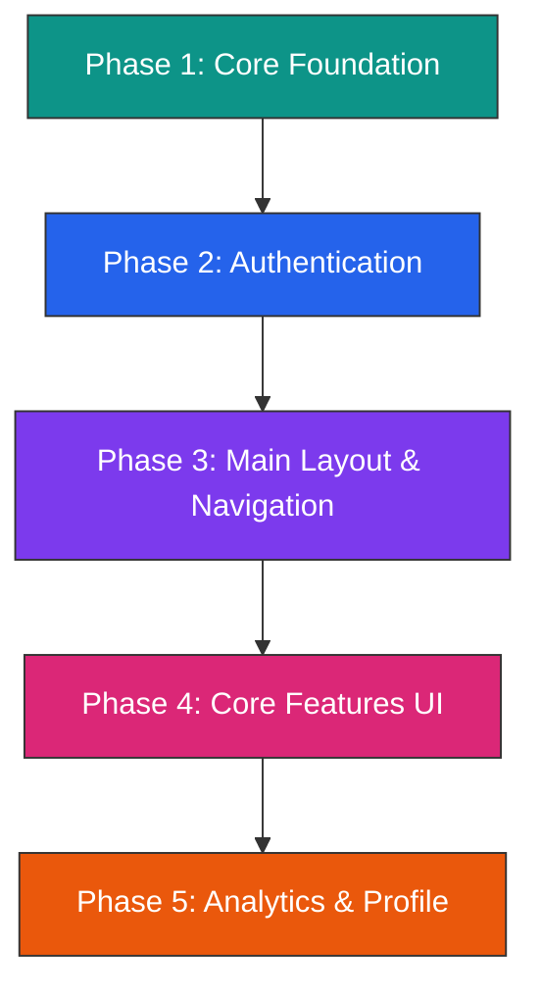

# 📋 Task Plan — AI PDF Summarizer Flutter Frontend

> **Vai trò:** Lead Flutter Developer  
> **Dự án:** AI PDF Summarizer — UI/UX Frontend  
> **Hiện trạng:** Project Flutter mới khởi tạo, chỉ có `main.dart` mặc định (counter app). Chưa có dependencies nào ngoài `cupertino_icons`.

---

## Tổng quan kiến trúc



---

## Phase 1 — Core Foundation, Theme & Architecture Setup

> **Mục tiêu:** Thiết lập nền tảng vững chắc — dependencies, Clean Architecture, theme system, routing, và shared widgets.

### 1.1 Dependencies (`pubspec.yaml`)

Cài đặt tất cả packages theo requirements:

| Package | Mục đích |
|---------|----------|
| `flutter_riverpod` | State management |
| `go_router` | Declarative routing |
| `dio` | HTTP client (chuẩn bị cho API) |
| `responsive_framework` | Responsive breakpoints |
| `flutter_animate` | Animation utilities |
| `fl_chart` | Charts cho Analytics |
| `file_picker` | PDF file picker |
| `flutter_markdown` | Render markdown content |
| `google_fonts` | Typography (Inter/Outfit) |
| `shimmer` | Loading shimmer effect |

### 1.2 Folder Structure

Tạo toàn bộ Clean Architecture skeleton:

```
lib/
├── core/
│   ├── theme/
│   │   ├── app_theme.dart          # ThemeData (Dark/Light)
│   │   ├── app_colors.dart         # Color palette (green neon, dark bg)
│   │   ├── app_text_styles.dart    # Typography system
│   │   └── glassmorphism.dart      # Glassmorphism decoration helpers
│   ├── constants/
│   │   └── app_constants.dart      # Breakpoints, durations, etc.
│   ├── routes/
│   │   └── app_router.dart         # GoRouter configuration
│   ├── widgets/
│   │   ├── app_button.dart         # Reusable gradient button
│   │   ├── app_text_field.dart     # Custom styled TextField
│   │   ├── glass_card.dart         # Glassmorphism card widget
│   │   └── loading_shimmer.dart    # Shimmer loading placeholder
│   └── utils/
│       └── responsive_helper.dart  # Screen size utilities
├── features/                       # (empty folders, chuẩn bị)
│   ├── auth/
│   ├── dashboard/
│   ├── pdf_summary/
│   ├── ai_chat/
│   ├── history/
│   └── profile/
├── shared/
│   └── mock_services/
│       ├── mock_auth_service.dart
│       ├── mock_summary_service.dart
│       └── mock_chat_service.dart
└── main.dart                       # ProviderScope + GoRouter + Theme
```

### 1.3 Theme System

- **Dark mode mặc định** với Material 3
- **Color palette:** Nền `#0A0A0A` / `#1A1A2E`, accent xanh neon `#00E676` / `#39FF14`
- **Glassmorphism helpers:** `BackdropFilter` + semi-transparent containers
- **Google Fonts:** Inter cho body, Outfit cho headings

### 1.4 Routing (GoRouter)

Khai báo tất cả routes:
- `/splash`
- `/login` → `/register`
- `/dashboard` (shell route với sidebar)
- `/dashboard/summary`
- `/dashboard/history`
- `/dashboard/analytics`
- `/dashboard/profile`

### 1.5 Mock Services

Tạo các mock services trả về fake data với `Future.delayed` để giả lập latency.

### Deliverables Phase 1
- [x] `pubspec.yaml` updated với tất cả dependencies
- [x] Folder structure hoàn chỉnh
- [x] Theme dark/light chạy được
- [x] GoRouter routes khai báo xong
- [x] `main.dart` setup `ProviderScope` + `MaterialApp.router`
- [x] Shared widgets: `GlassCard`, `AppButton`, `AppTextField`, `LoadingShimmer`
- [x] Mock services skeleton

---

## Phase 2 — Authentication Screens

> **Mục tiêu:** Hoàn thiện luồng Splash → Login → Register với UI glassmorphism, animations, và mock auth.

### 2.1 Splash Screen
```
features/auth/presentation/screens/splash_screen.dart
```
- Logo animated (scale + fade in)
- Gradient background xanh lá → đen
- Loading indicator dưới logo
- Auto-navigate → Login sau 2.5s

### 2.2 Login Screen
```
features/auth/presentation/screens/login_screen.dart
features/auth/presentation/widgets/login_form.dart
```
- **Background:** Gradient mesh hoặc animated particles
- **Card trung tâm:** Glassmorphism card chứa form
- **Form fields:** Email, Password (với toggle visibility)
- **Buttons:** Login gradient, Google login (icon), Register link
- **Checkbox:** Remember me
- **Link:** Forgot password
- **Responsive:** Full-screen card trên mobile, centered card trên desktop

### 2.3 Register Screen
```
features/auth/presentation/screens/register_screen.dart
```
- Tương tự layout Login
- Fields: Name, Email, Password, Confirm Password
- Register button
- "Already have account?" → Login link

### 2.4 Auth State Management
```
features/auth/providers/auth_provider.dart
features/auth/data/models/user_model.dart
```
- `authProvider` (Riverpod) quản lý trạng thái login/logout
- `UserModel`: name, email, avatar
- Mock login: bất kỳ email/password nào cũng OK, delay 1.5s

### Deliverables Phase 2
- [x] Splash Screen với animated logo
- [x] Login Screen glassmorphism + responsive
- [x] Register Screen
- [x] Auth provider + mock auth service
- [x] Page transitions mượt (fade/slide)
- [x] Form validation cơ bản

---

## Phase 3 — Main Dashboard Layout & Sidebar Navigation

> **Mục tiêu:** Xây dựng layout chính 3 cột responsive (Sidebar | Content | AI Chat) và navigation system.

### 3.1 Dashboard Shell
```
features/dashboard/presentation/screens/dashboard_shell.dart
```
- **Desktop (≥1200px):** `Row` → `[Sidebar (250px) | Expanded Content | AI Chat Panel (350px)]`
- **Tablet (600–1200px):** Collapsible sidebar (icon-only mode) + Content
- **Mobile (<600px):** Drawer + Content + Bottom nav

### 3.2 Sidebar
```
features/dashboard/presentation/widgets/sidebar.dart
features/dashboard/presentation/widgets/sidebar_item.dart
```
- App logo ở trên
- **"+ New Summary"** button nổi bật (gradient green)
- Navigation items với icons + active indicator:
  - 📊 Dashboard
  - 📄 Summaries
  - 💬 AI Chat
  - 📚 History
  - ⚙️ Settings
- **Search bar** tìm history
- **User profile section** ở dưới (avatar + name + logout)
- Hover effects trên desktop
- Collapse animation khi chuyển tablet mode

### 3.3 Mobile Navigation
```
features/dashboard/presentation/widgets/mobile_bottom_nav.dart
features/dashboard/presentation/widgets/mobile_drawer.dart
```
- Bottom navigation bar cho mobile
- Drawer navigation mở rộng đầy đủ chức năng sidebar

### 3.4 Content Area
- Placeholder cho nội dung chính (sẽ điền ở Phase 4)
- Welcome/empty state đẹp

### Deliverables Phase 3
- [x] Dashboard 3-column layout responsive
- [x] Sidebar hoàn chỉnh với navigation
- [x] Mobile drawer + bottom nav
- [x] Tablet collapsible sidebar
- [x] Shell route GoRouter hoạt động đúng
- [x] Smooth transitions khi chuyển tab

---

## Phase 4 — Core Feature Screens (PDF Summary + AI Chat)

> **Mục tiêu:** Xây dựng 2 tính năng cốt lõi — PDF Upload/Summary và AI Chat.

### 4.1 PDF Upload Section
```
features/pdf_summary/presentation/screens/pdf_upload_screen.dart
features/pdf_summary/presentation/widgets/drop_zone.dart
features/pdf_summary/presentation/widgets/file_preview_card.dart
features/pdf_summary/presentation/widgets/upload_progress.dart
```
- **Drop zone:** Dashed border area, icon upload, text "Drag & Drop PDF here"
- **Desktop:** Drag & drop hỗ trợ
- **Mobile:** Button "Choose File" → `file_picker`
- **File preview:** Tên file, kích thước, icon PDF, nút remove (X)
- **Progress bar:** Animated progress khi "uploading"
- **"Summarize" button:** Trigger mock summarize

### 4.2 Summary Display Section
```
features/pdf_summary/presentation/screens/summary_result_screen.dart
features/pdf_summary/presentation/widgets/summary_content.dart
features/pdf_summary/presentation/widgets/export_buttons.dart
```
- **Summary title** (auto-generated từ file name)
- **Markdown rendered content** (scrollable, `flutter_markdown`)
- **Action buttons:** Copy, Download (.txt, .pdf, .docx)
- **Loading state:** Shimmer loading → typing animation → full content
- Mock summary: Lorem ipsum dạng markdown có headings, bullets, bold

### 4.3 Summary Provider
```
features/pdf_summary/providers/summary_provider.dart
```
- States: `idle` → `uploading` → `processing` → `completed` → `error`
- Mock service delay 2-3s

### 4.4 AI Chat Section
```
features/ai_chat/presentation/screens/ai_chat_screen.dart
features/ai_chat/presentation/widgets/chat_message_bubble.dart
features/ai_chat/presentation/widgets/chat_input_bar.dart
features/ai_chat/presentation/widgets/typing_indicator.dart
```
- **UI giống ChatGPT/Claude:**
  - Message list scrollable
  - User bubble (phải, màu xanh) + AI bubble (trái, màu xám)
  - Avatar cho user và AI
  - Markdown rendering trong messages
- **Typing indicator:** 3 dots animation khi AI "đang trả lời"
- **Chat input bar:** Fixed bottom, multi-line expandable, send button
- **Desktop:** Enter to send, Shift+Enter new line
- **Auto scroll** xuống tin nhắn mới

### 4.5 Chat Provider
```
features/ai_chat/providers/chat_provider.dart
features/ai_chat/data/models/chat_message_model.dart
```
- `chatProvider` quản lý list messages
- Mock AI response: random từ danh sách câu trả lời mẫu, delay 1-2s

### Deliverables Phase 4
- [x] PDF upload với drag & drop + file picker
- [x] File preview card
- [x] Upload progress animation
- [x] Summary display với markdown rendering
- [x] Export buttons (Copy/Download)
- [x] AI Chat UI hoàn chỉnh kiểu ChatGPT
- [x] Typing indicator animation
- [x] Chat input bar responsive
- [x] Summary + Chat providers với mock data

---

## Phase 5 — History, Analytics Dashboard & Profile

> **Mục tiêu:** Hoàn thiện các màn hình phụ trợ — lịch sử, analytics charts, và profile.

### 5.1 History Screen
```
features/history/presentation/screens/history_screen.dart
features/history/presentation/widgets/history_list_item.dart
features/history/presentation/widgets/history_filter_bar.dart
```
- **List view:** Cards hiển thị PDF name, summary snippet, thời gian
- **Tabs:** All / PDFs / Summaries / Chats
- **Filter bar:** Search, sort (mới nhất, cũ nhất), filter by date
- **Tap item** → xem lại summary hoặc chat
- Mock data: 10-15 items mẫu

### 5.2 Analytics Dashboard
```
features/dashboard/presentation/screens/analytics_screen.dart
features/dashboard/presentation/widgets/stat_card.dart
features/dashboard/presentation/widgets/chart_section.dart
```
- **Statistics cards** (4 cards): Total PDFs, Total Summaries, Total Chats, Avg Processing Time
  - Animated counter khi load
  - Icon + gradient background
- **Charts** (`fl_chart`):
  - **Line chart:** Usage over time (7 days)
  - **Bar chart:** PDFs per category
  - **Pie chart:** Summary types distribution
- **Recent activities list:** Last 5 uploads, summaries, chats
- Mock data cho tất cả

### 5.3 Profile Screen
```
features/profile/presentation/screens/profile_screen.dart
features/profile/presentation/widgets/profile_header.dart
features/profile/presentation/widgets/settings_section.dart
```
- **Avatar** (placeholder circle)
- **User info:** Name, Email (editable)
- **Theme switch:** Dark/Light toggle
- **Device list:** Mock danh sách devices
- **Logout button**

### 5.4 Polish & Final Integration
- Review tất cả page transitions
- Kiểm tra responsive trên mọi breakpoint
- Đảm bảo theme consistency
- Hover effects trên desktop
- Loading states cho mọi screen
- Error states UI

### Deliverables Phase 5
- [x] History screen với search/filter/sort
- [x] Analytics dashboard với 3 loại charts
- [x] Statistics cards animated
- [x] Profile screen với theme toggle
- [x] Polish toàn bộ animations
- [x] Responsive testing hoàn chỉnh

---

## 📊 Ước lượng Timeline

| Phase | Nội dung | Ước lượng |
|-------|----------|-----------|
| **Phase 1** | Core, Theme, Architecture | ~1 session |
| **Phase 2** | Auth Screens | ~1 session |
| **Phase 3** | Dashboard Layout & Sidebar | ~1 session |
| **Phase 4** | PDF Summary + AI Chat | ~1-2 sessions |
| **Phase 5** | History + Analytics + Profile | ~1-2 sessions |
| **Tổng** | | **~5-7 sessions** |

---

## ⚠️ Ghi chú quan trọng

> [!IMPORTANT]
> - Tất cả dữ liệu đều dùng **mock/fake** — chưa kết nối backend thật
> - Code phải thiết kế theo pattern **repository** để dễ swap mock → real API sau
> - Mỗi feature folder sẽ có cấu trúc: `data/` → `providers/` → `presentation/` (screens + widgets)

> [!NOTE]
> - Project hiện tại là **Flutter mới khởi tạo** (counter app template), sẽ xoá sạch code mẫu
> - SDK: `^3.11.5` — dùng Dart 3 mới nhất, có null safety, pattern matching
> - Dependencies hiện tại chỉ có `cupertino_icons` — cần thêm ~10 packages ở Phase 1

---

**👉 Xin hãy review kế hoạch trên. Tôi sẽ bắt đầu triển khai sau khi bạn phê duyệt.**
